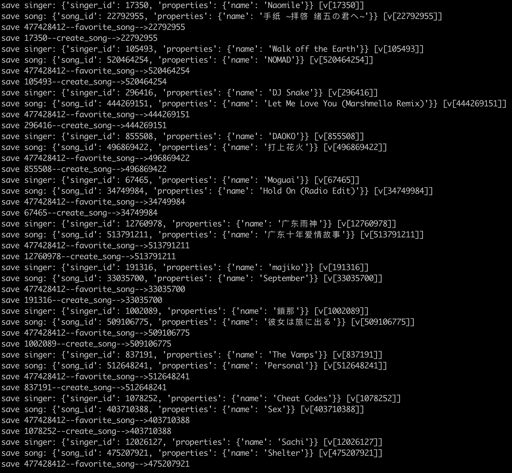
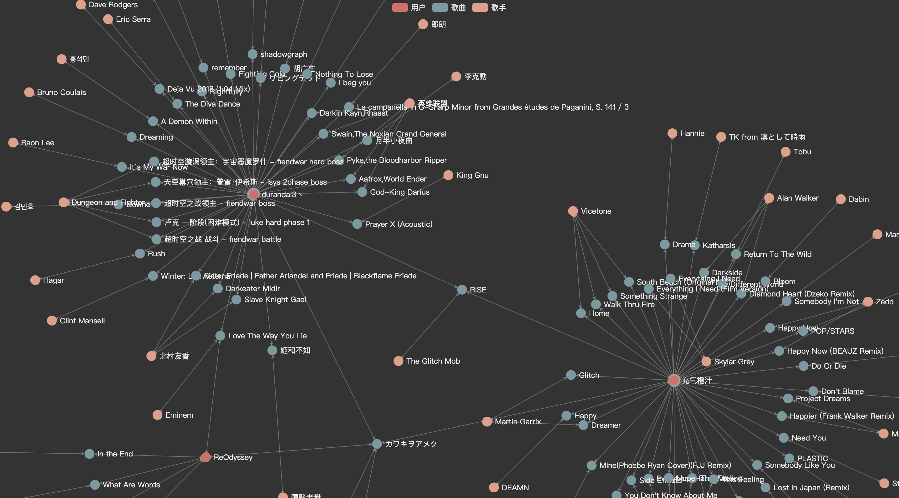
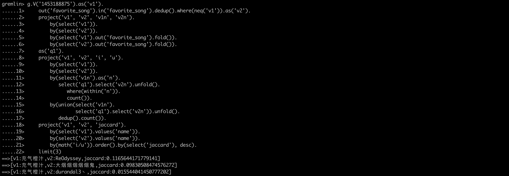

# NeteaseCloudMusicGraph

使用图数据库对网易云音乐数据进行分析

其中网易云音乐的抓取参考 [xiyouMc/ncmbot](https://github.com/xiyouMc/ncmbot)

## 功能特性

- 根据用户喜欢的音乐计算用户间兴趣的相似度

## 环境要求

需要 Python 3+ 环境，图数据库使用的是阿里云公测版本的 GDB 实例

## 安装

```shell
$ git clone https://github.com/lichangao1826/NeteaseCloudMusicGraph.git
$ cd NeteaseCloudMusicGraph
$ pip3 install -r requirements.txt
```

## 配置

- 修改 `config/settings.py` 中的 `environ` 指定运行环境
- 修改相应目录下的 `auth/graph.py` 文件，设置图数据库认证信息

## 运行

```shell
$ cd scripts && python3 run_spider.py
```

## 测试

### 运行日志



### 图数据可视化



### 相似度（Jaccard 得分）计算



## TODO

- [ ] 兼容 Neo4j 作为图数据的存储
- [ ] 对用户所有的歌单（包括创建、收藏的歌单）进行相似度计算
- [ ] 根据歌单中歌曲的顺序设置不同权重
- [ ] 将歌手（包括直接关注、歌单涉及的歌手）加入相似度计算中

## License

[The MIT License (MIT)](./LICENSE)